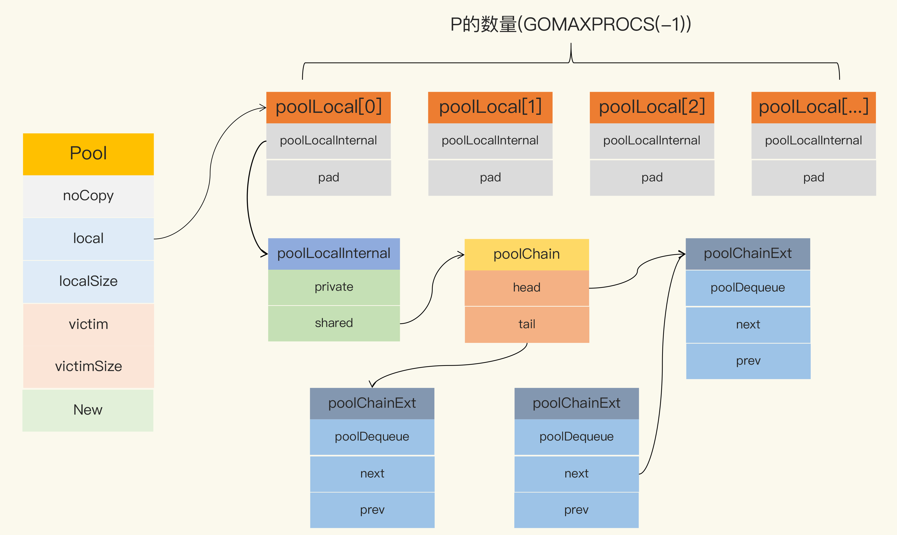

# Go 并发编程实战笔记

## Mutex

### 代码风格

一般来说，mutex放到需要保护变量的上方，如果被保护变量有多个，则需要放到一起，如果被保护对象和其他变量存放到一起，请用空行隔开

```
// 保护变量a
type test struct{
    mtx sync.Mutex
    a int
}

// 保护变量a、b
type test struct{
    mtx sync.Mutex
    a int
    b int
}

// 保护变量a
type test struct{
    mtx sync.Mutex
    a int

    b int
}
```

### data race 检测

在编译（compile）、测试（test）或者运行（run）Go 代码的时候，加上 race 参数，就有可能发现并发问题。比如go run -race counter.go。当有多个goroutine读写一个变量而没有加保护，则会打印该goroutine信息。这就需要加上mutex进行保护

原理，通过在编译时给所有变量添加读写屏障来检测并发问题。但只有在实际运行时才会检测出来，如果一个特定分支代码一直没有运行到，即使有数据并发，也不会检测到。同时添加读写屏障会增加额外成本

### mutex 特性

* 机会不平均，唤醒的goroutine和新goroutine没有拿到锁，会自旋一段时间，尝试拿锁，这样提高当前goroutine拿到锁的概率，可以减少goroutine上下文切换
* 解决饥饿，由于机会不平均，可能会使等待的goroutine始终获取不到锁，所以会有1ms的解决方式

### mutex 常见的使用误区

* **Lock和Unlock接口不是成对出现的。这样很容易忘记Unlock，而且mutex不会进行goroutine检查，所以理论上可以一个goroutine加锁，另一个goroutine解锁。但强烈不建议这样做，既危险也复杂**
* **Copy 已使用的 Mutex，mutex是有状态的，所以mutex不允许考虑。特别需要注意包含mutex的结构体也是不运行拷贝**
* **重入，mutex不支持重入**

## map

### 基本使用方法

#### key是可比较类型

在golang中，bool、整数、浮点数、复数、字符串、指针、channel、接口都是可比较的，包含可比较元素的 struct 和数组；而 slice、map、函数值都是不可比较的，所以slice、map、函数值都不可用于map的key

#### 循环遍历的结果是无序的

### 如何保证map的并发

在多个goroutine访问map，会有数据竞争问题

#### 使用读写锁

适用于写次数较少的场景

#### 使用分片加锁

当写次数较高时，读写锁会影响到读的性能。分片加锁根据key来划分锁的有效范围，使用多个锁降低每个锁的范围，提高效率

#### sync.Map

当写次数较高时，读写锁会影响到读的性能。sync.Map引入缓存机制，隔绝了读写冲突。进而提高了读写性能。但随着数据更新，缓存命中下架，则需要在写操作判断是否更新缓存并执行。则将增加这次写操作的耗时。所以当数据大量更新时，会影响读写正常执行。

以下场景，sync.Map可以提供比sync.RWMutex+map很好的读写性能

* 只会增长的缓存系统中，一个 key 只写入一次而被读很多次。sync.Map可以提供不加锁的读
* 多个 goroutine 为不相交的键集读、写和重写键值对，这时多个goroutine不会产生数据竞争

实现原理

* 空间换时间。使用冗余的数据结构，一个只读的read段，一个用锁保护的可修改的dirty段。由此来减少对锁的调用次数
* 新增数据加锁在dirty段新增
* 访问数据优先从read段读取，命中失败再加锁访问dirty段。命中次数超过read段键值对个数，则提升dirty段位read段，并将提升的read段有效数据拷贝到新的dirty段
* 更新数据，value是指针，read段和dirty段的键值对中的value指向同一个对象，访问value使用atom方式，不用加锁
* 删除数据采用更新要删除键值对的value为nil来等效删除，不用加锁。等到下次提升dirty段为read段，将提升的read段有效数据拷贝到新的dirty段时，会将value为nil的数据实际的删除

sync.Map和sync.RWMutex+map如何选择

* 写场景较多时，请使用sync.RWMutex+map
* 读多写少场景，如果性能不是问题，请使用 sync.RWMutex+map，因为sync.map没有确定类型，无法做到类型检查，这时优先考虑类型安全和易用性
* 读多写少场景，性能要求较高，请使用sync.Map，特别是sync.Map优化的两种场景

## channel

### 实现原理

* 内部使用两个等待队列完成send和recv的阻塞和唤醒
* 内部使用环形数组来实现缓存
* 当send时，如果缓存为空，且有recv等待，则直接唤醒一个recv完成数据传递，提高效率；如果有缓存空间，则将数据放到环形数组尾端；如果没有缓存空间，则将send goroutine加入send等待队列，并阻塞
* 当recv时，如果缓存为空，则将recv goroutine加入recv等待队列，并阻塞；如果缓存不为空，则取出环形队列的头元素进行返回，这时如果send等待队列不为空，则取出头部等待队列，将send的数据当道环形数组尾端，并唤醒send goroutine

### **使用 Channel 容易犯的错误**

#### panic

* close 为 nil 的 chan
* send 已经 close 的 chan
* close 已经 close 的 chan

#### goroutine 泄漏

```

func process(timeout time.Duration) bool {
    ch := make(chan bool)
    go func() {
        // 模拟处理耗时的业务
        time.Sleep((timeout + time.Second))
        ch <- true // block
        fmt.Println("exit goroutine")
    }()
    select {
    case result := <-ch:
        return result
    case <-time.After(timeout):
        return false
    }
}
```

## sync.Pool 对象池

### 实现原理

使用put和get来管理对象的创建和回收，达到复用对象的目的

### 历史优化

go1.13前sync.Pool有如下问题，在1.13做了优化

#### gc会将所有缓存的对象都移除掉

使用local和victim两个buffer来解决gc的问题

当gc时，会将victim的对象回收掉，并且将local对象移动到victim。put操作会优先从local获取对象，如果为空则从victim中获取；get操作会将对象放到local

#### sync.Pool 为了支持协程安全，加了锁，会影响性能

使用新的数据结构



在local和victim的buffer中，分为P数量等同的poolLocal数组，每个poolLocal中分为private和share。

* private是一个缓存的对象，只给对应一个P使用。由于P同一时间只会运行一个goroutine，所以不会有竞争问题。在一个goroutine中反复获取和释放也非常快，且不和其他P的goroutine竞争
* share是缓存对象组成的链表，只能由对应的P在链表头增加元素，但可以由多个P在链表尾获取元素。即一个生产者多个消费者，可以使用无锁来解决，只需要让tail设置为atom操作即可。在回收对象时，如果private有值，则将对象放入share链表中

为每个P分配一个链表，将单个work多生产者多消费者的模型修改为多个work，每个work但生产者多消费者模型，这样就可以使用无锁队列了。同时还为每个P分配一个私有的对象，用于提高单个goroutine无竞争下的获取和回收操作

### 使用误区

#### 内存泄漏

如果对象是slice，长度不固定。随着使用时的不停append，最终会将非常长的slice放到缓存中，这个slice在后续大部分使用中都不会使用如此长度，且可能不会被回收

解决方式

* 可以在回收时进行判断，太长的slice就不回收了
* 上述方式还是会浪费内存，可以将slice根据长度分为64、1k、4k等多个buffer，按需使用


## 信号量

### go官方扩展库的实现 Weighted

特点

* 当获取的资源数大于初始化的资源数，Weighted的Acquire会直接阻塞
* Weighted中Acquire获取资源阻塞时，会采用严格的先入先出原则。比如初始化资源为100，第一个goroutine获取了50个资源，第二个goroutine想要获取90个资源则会阻塞，第三个的goroutine想获取1个资源也会阻塞，只有二个goroutine主动释放才会让第三个goroutine获取资源
